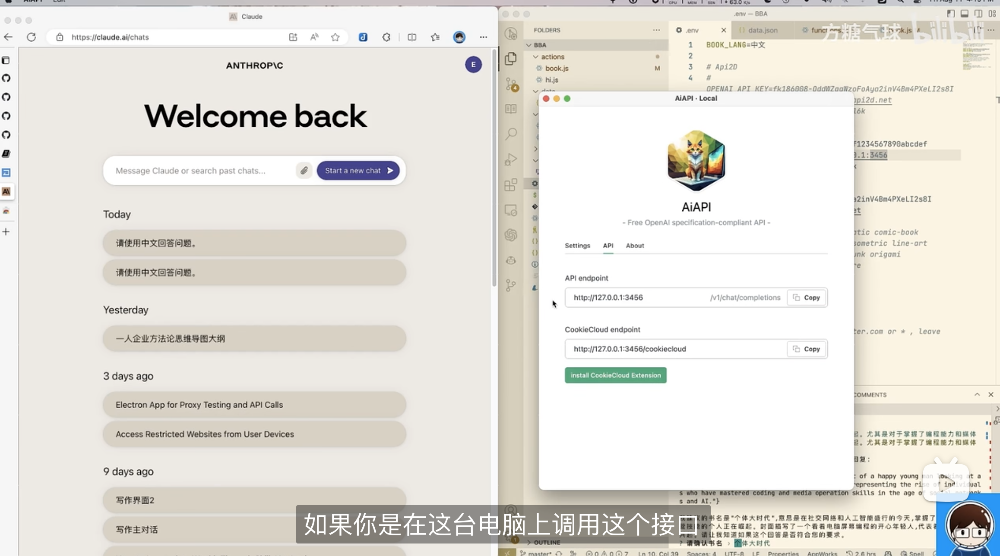
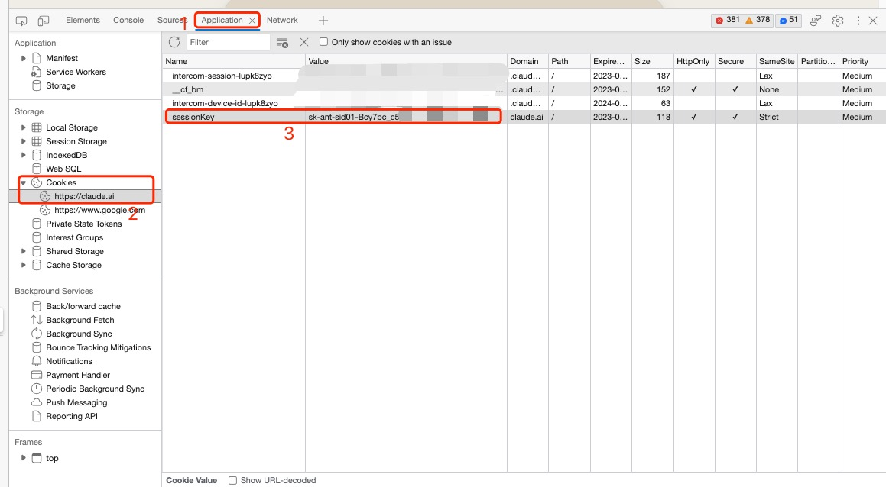

# AiAPI

> 这是软件的下载和支持页面

AiAPI是个跨平台客户端，它可以将 Claude 网站转化为 OpenAI 兼容的 API，这样你就可以在所有兼容 OpenAI 的软件里边使用 Claude 的 100k 上下文能力。更棒的是，这是免费的。感谢Claude。

# 特色功能

1. 跨平台，Mac/Windows均可使用
1. 基于 Claude2，提供100k上下文
1. 兼容 OpenAI API，直接重用 OpenAI 的现有工具
1. 支持 CookieCloud 浏览器插件，可以自动定时刷新和同步Cookie

# 下载

请移步[仓库的 Release](https://github.com/easychen/aiapi/releases) 

# 界面和功能

# 视频教程

[请移步B站](https://www.bilibili.com/video/BV1Ku4y1q75F?t=946.6)

# 使用说明

1. <https://claude.ai> 注册账号并登入
1. 进入 <https://claude.ai/chats> 页面，F12打开DevTools → Applications → Cookies → 复制sessionKey

1. 将 sessionKey 填入到 Settings 面板中，并保存

1. 将原来填写OpenAI API Endpoint 的地方改为 http://127.0.0.1:3456 即可（如果原来后边有/v1/...，那么把这部分也加上）
1. API Key可以随意填写，但部分客户端可能对格式有校验，因此你也可以使用这个 `sk-1234567890ULScvLPEHbT3B3bkFJ34mOSRJSVf9fMWP8UXyw`
1. ~~本接口目前只支持 stream 模式，因此请打开`流式输出`选项~~ 已在 1.0.2 版本支持

# 兼容性说明

1. 目前仅兼容 `/v1/chat/completions` 接口、`messages` 参数。模型直接使用 `claude-2`。
1. 支持连续对话，`messages` 参数会自动拼接。

# 使用AiAPI的项目

1. [book-by-ai](https://github.com/easychen/book-by-ai)：使用AI生成高质量的电子书
