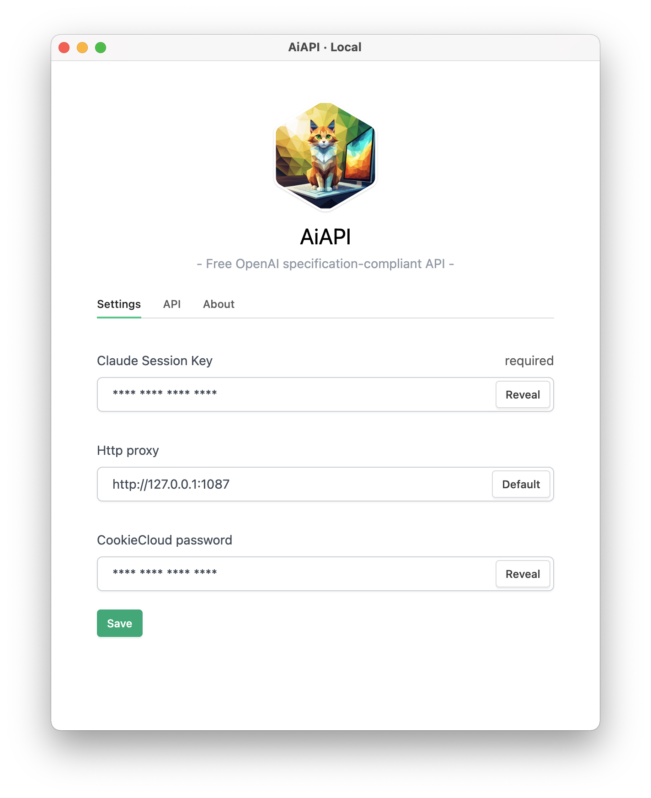
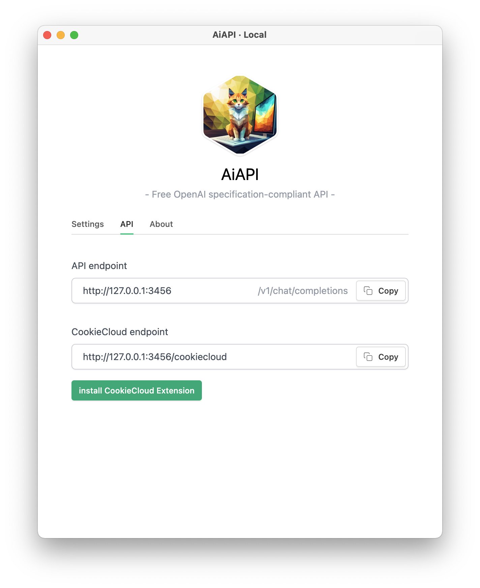
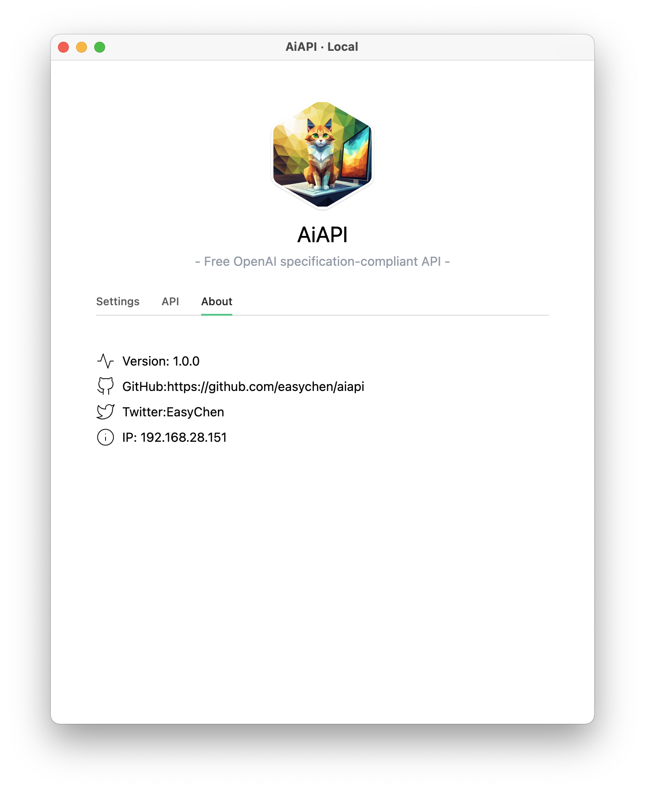

# AiAPI

> This is the download and support page for the software

[简体中文](./README-CN.md) | [English](./README.md)

AiAPI is a cross-platform client that converts the Claude website into an OpenAI-compatible API, allowing you to use Claude's 100k context capability in any OpenAI-compatible software. What's even better is that it's free. Thanks to Claude.

# Key Features

1. Cross-platform, works on Mac and Windows
2. Based on Claude2, provides 100k context
3. Compatible with OpenAI API, allowing direct reuse of existing OpenAI tools
4. Supports the CookieCloud browser extension, which can automatically refresh and synchronize cookies

# Download

Please go to the [Releases section of the repository](https://github.com/easychen/aiapi/releases).

# Interface and Functionality

# Compatibility Notes

1. Currently, only the `/v1/chat/completions` endpoint and the `messages` parameter are supported. The model used is `claude-2`.
2. Continuous conversation is supported, and the `messages` parameter will be automatically concatenated.

