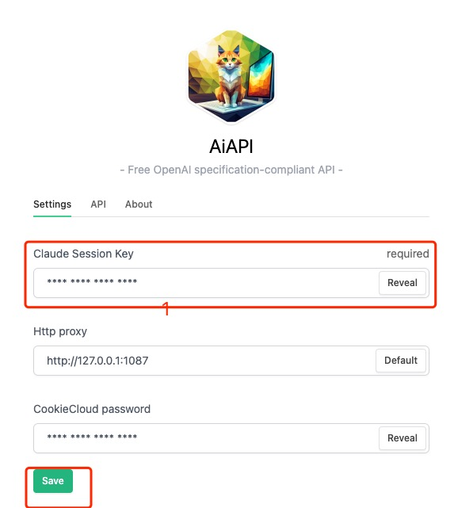

# AiAPI

> This is the download and support page for the software

[简体中文](./README-CN.md) | [English](./README.md)

AiAPI is a cross-platform client that converts the Claude website into an OpenAI-compatible API, allowing you to use Claude's 100k context capability in any OpenAI-compatible software. What's even better is that it's free. Thanks to Claude.

# Key Features

1. Cross-platform, works on Mac and Windows
2. Based on Claude2, provides 100k context
3. Compatible with OpenAI API, allowing direct reuse of existing OpenAI tools
4. Supports the CookieCloud browser extension, which can automatically refresh and synchronize cookies

# Download

Please go to the [Releases section of the repository](https://github.com/easychen/aiapi/releases).

# Interface and Functionality

# User Guide

1. Register and log in to your account at <https://claude.ai>.
1. Go to the page <https://claude.ai/chats>, open DevTools by pressing F12, and navigate to Applications → Cookies. Copy the sessionKey.

1. Paste the sessionKey into the Settings panel and save.

1. Change the OpenAI API Endpoint to http://127.0.0.1:3456 (if there is a /v1/... at the end, include it as well).
1. You can enter any API Key, but some clients may have format validation. You can use this key: `sk-1234567890ULScvLPEHbT3B3bkFJ34mOSRJSVf9fMWP8UXyw`.
1. ~~This interface currently only supports stream mode, so please enable the "Stream Output" option.~~ added in version 1.0.2

# Compatibility Notes

1. Currently, only the `/v1/chat/completions` endpoint and the `messages` parameter are supported. The model used is `claude-2`.
2. Continuous conversation is supported, and the `messages` parameter will be automatically concatenated.

